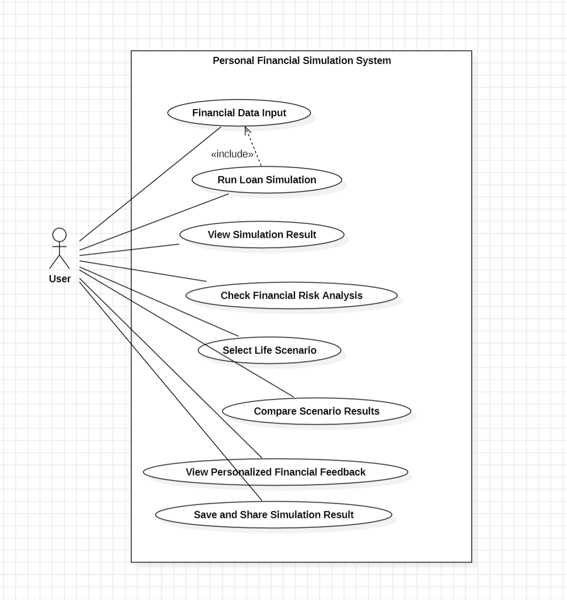

#  Analysis Report: 금융 시뮬레이션 시스템

**학번:** [22110939]  
**이름:** [여상유]  
**E-Mail:** [sangyu765@gmail.com]

---

## [ Revision History ]

| Revision Date | Version # | Description | Author |
|:---:|:---:|:---|:---:|

---

## = Contents =

1. [Introduction](#1-introduction)
2. [Use Case Analysis](#2-use-case-analysis)
3. [Domain Analysis](#3-domain-analysis)
4. [User Interface Prototype](#4-user-interface-prototype)
5. [Glossary](#5-glossary)
6. [References](#6-references)

---

## 1.Introduction
본 문서는 Conceptualization 단계에 이어, 설계된 금융 시뮬레이션 시스템을 다양한 시나리오를 통해 분석하고 그 결과를 해석하는 것을 목적으로 합니다.

  본 문서는 사용자가 금융 핵심 지표를 직관적으로 이해하고 체험할 수 있도록 설계된 ‘금융 시뮬레이션 및 교육 시스템’의 분석 결과를 제시한다. 본 시스템은 LTV와 DSR과 같은 주요 대출 규제 지표를 기반으로 사용자의 재무 상태를 정량적으로 분석하고 다양한 시나리오를 통해 그 변화를 확인할 수 있도록 구성되어 있습니다. 이를 통해 단순 계산 도구를 넘어서 사용자 중심의 금융 의사결정 지원 및 교육 플랫폼으로서의 역할을 수행합니다.
  
### 유용성 (Usefulness)
본 시스템은 사용자가 다양한 금융 시나리오를 직접 실험할 수 있습니다. 자신의 재무 상태에 따른 대출 가능 범위와 상환 부담을 구체적으로 파악할 수 있도록 합니다. 특히 사회초년생의 경우에는 LTV 및 DSR 규제를 실제 데이터에 적용해봄으로써 무리한 채무 발생 가능성을 사전에 인지할 수 있습니다. 이는 실질적인 금융 의사결정 과정에서 중요한 판단 기준으로 작용합니다.

### 중요성 (Significance)
본 프로젝트는 시뮬레이션 기반의 능동적 학습 환경을 제공합니다. 사용자가 금리 변화나 정책 변화에 따른 재무적 영향을 사전에 경험할 수 있도록 합니다. 이를 통해 금융 의사결정 과정에서 발생할 수 있는 리스크를 구조적으로 이해하고 보다 합리적인 경제적 판단 능력을 형성하는 데 기여합니다.

### 확장성 (Expandability)
본 시스템은 다양한 금융 변수와 시나리오를 모듈화하여 설계되었기 때문에 기능 확장이 용이합니다. 현재의 대출 규제 분석 모델을 기반으로 향후 자산 관리, 투자 포트폴리오 시뮬레이션, 다양한 금융 상품 분석, 리스크 평가 모델 등을 추가할 수 있습니다. 이를 통해 보다 현실적인 종합 금융 시뮬레이션 플랫폼으로 발전시킬 수 있습니다.

---

## 2.Use case analysis

본 시스템은 개인 사용자를 대상으로 하는 금융 시뮬레이션입니다. 따라서 Actor는 User 한 명으로 설정하였습니다.

Financial Data Input: 사용자의 소득, 자산, 부채 정보를 입력 및 수정

Run Loan Simulation: 입력된 데이터를 기반으로 LTV/DSR 수치 계산 실행

View Simulation Result: 계산된 결과 확인

Check Financial Risk Analysis: 재무 위험도 등급 확인

Select Life Scenario: 주택 구매, 결혼 등 특정 생애 상황 선택 및 적용

Compare Scenario Results: 여러 시뮬레이션 결과 데이터 대조 및 비교

View Personalized Financial Feedback: 분석 결과에 따른 맞춤형 금융 가이드 확인

Save and Share Result: 시뮬레이션 리포트 저장 및 외부 공유
# Use Case Description

---

## Use Case #1: 재무 정보 입력 및 수정

### GENERAL CHARACTERISTICS
- **Summary**: 사용자가 자신의 소득, 자산, 부채 및 금리 정보를 입력하고 수정한다.
- **Scope**: 금융 시뮬레이션 시스템
- **Level**: User Level
- **Primary Actor**: User
- **Preconditions**: 시스템이 실행 중이어야 한다.
- **Trigger**: 사용자가 재무 정보 입력 화면에 접근할 때
- **Success Post Condition**: 입력된 재무 정보가 시스템에 저장된다.
- **Failed Post Condition**: 입력값이 유효하지 않은 경우 오류 메시지를 출력한다.

### MAIN SUCCESS SCENARIO
1. 사용자가 재무 정보 입력 화면에 접근한다.
2. 사용자가 소득, 자산, 부채 및 금리 정보를 입력한다.
3. 시스템은 입력 데이터를 검증한다.
4. 시스템은 데이터를 저장한다.

### EXTENSION SCENARIOS
- **3a. 입력값이 잘못된 경우**
  - 시스템은 오류 메시지를 출력하고 재입력을 요청한다.

---

## Use Case #2: 대출 시뮬레이션 실행

### GENERAL CHARACTERISTICS
- **Summary**: 사용자가 입력한 재무 정보를 기반으로 대출 가능 금액과 상환 부담을 계산한다.
- **Scope**: 금융 시뮬레이션 시스템
- **Level**: User Level
- **Primary Actor**: User
- **Preconditions**: 재무 정보가 입력되어 있어야 한다.
- **Trigger**: 사용자가 시뮬레이션 실행 버튼을 클릭할 때
- **Success Post Condition**: 대출 가능 금액과 상환 금액이 계산된다.
- **Failed Post Condition**: 입력 데이터가 부족하거나 오류가 발생하면 계산이 수행되지 않는다.

### MAIN SUCCESS SCENARIO
1. 사용자가 시뮬레이션 실행을 요청한다.
2. 시스템은 입력 데이터를 검증한다.
3. 시스템은 LTV 및 DSR 기준을 적용하여 계산을 수행한다.
4. 시스템은 결과를 생성한다.

### EXTENSION SCENARIOS
- **2a. 입력 데이터가 누락된 경우**
  - 시스템은 오류 메시지를 출력한다.
- **3a. 계산 중 오류 발생**
  - 시스템은 계산을 중단하고 오류를 알린다.

---

## Use Case #3: 시뮬레이션 결과 확인

### GENERAL CHARACTERISTICS
- **Summary**: 사용자가 시뮬레이션 결과를 수치 및 시각화 형태로 확인한다.
- **Scope**: 금융 시뮬레이션 시스템
- **Level**: User Level
- **Primary Actor**: User
- **Preconditions**: 시뮬레이션이 완료되어야 한다.
- **Trigger**: 시뮬레이션 결과 화면이 표시될 때
- **Success Post Condition**: 사용자가 결과를 확인할 수 있다.
- **Failed Post Condition**: 결과가 존재하지 않을 경우 화면이 표시되지 않는다.

### MAIN SUCCESS SCENARIO
1. 시스템이 결과 화면을 출력한다.
2. 사용자가 결과 값을 확인한다.
3. 시스템은 그래프 및 시각화 정보를 함께 제공한다.

---

## Use Case #4: 재무 위험도 분석 확인

### GENERAL CHARACTERISTICS
- **Summary**: 사용자가 LTV 및 DSR 기준에 따른 재무 위험도를 확인한다.
- **Scope**: 금융 시뮬레이션 시스템
- **Level**: User Level
- **Primary Actor**: User
- **Preconditions**: 시뮬레이션 결과가 존재해야 한다.
- **Trigger**: 결과 화면에서 위험도 정보를 요청할 때
- **Success Post Condition**: 위험도가 ‘안전’, ‘주의’, ‘위험’으로 표시된다.
- **Failed Post Condition**: 위험도 계산이 불가능한 경우 표시되지 않는다.

### MAIN SUCCESS SCENARIO
1. 사용자가 위험도 분석 결과를 확인한다.
2. 시스템은 LTV 및 DSR 값을 기준으로 등급을 산출한다.
3. 시스템은 결과를 시각적으로 표시한다.

---

## Use Case #5: 생애 시나리오 선택

### GENERAL CHARACTERISTICS
- **Summary**: 사용자가 특정 상황을 선택하여 조건을 변경한다.
- **Scope**: 금융 시뮬레이션 시스템
- **Level**: User Level
- **Primary Actor**: User
- **Preconditions**: 시스템이 실행 중이어야 한다.
- **Trigger**: 사용자가 시나리오 선택 메뉴를 사용할 때
- **Success Post Condition**: 선택된 시나리오가 적용된다.
- **Failed Post Condition**: 시나리오 적용이 실패하면 기본값 유지

### MAIN SUCCESS SCENARIO
1. 사용자가 시나리오 목록을 확인한다.
2. 사용자가 특정 시나리오를 선택한다.
3. 시스템은 해당 조건을 반영한다.

---

## Use Case #6: 시나리오 결과 비교

### GENERAL CHARACTERISTICS
- **Summary**: 사용자가 여러 시나리오 결과를 비교한다.
- **Scope**: 금융 시뮬레이션 시스템
- **Level**: User Level
- **Primary Actor**: User
- **Preconditions**: 여러 시나리오 결과가 존재해야 한다.
- **Trigger**: 사용자가 비교 기능을 선택할 때
- **Success Post Condition**: 결과가 비교 형태로 표시된다.
- **Failed Post Condition**: 비교할 데이터가 부족한 경우 표시되지 않는다.

### MAIN SUCCESS SCENARIO
1. 사용자가 비교 기능을 실행한다.
2. 시스템은 시나리오 결과를 불러온다.
3. 시스템은 주요 지표를 비교 형태로 표시한다.

---
## Use Case #7: 분석된 정보 피드백

### GENERAL CHARACTERISTICS
- **Summary**: 사용자의 시뮬레이션 결과(LTV/DSR)를 바탕으로 개인화된 재무 조언 및 개선 가이드를 제공한다.
- **Scope**: 금융 시뮬레이션 시스템
- **Level**: User Level
- **Primary Actor**: User
- **Preconditions**: 시뮬레이션 실행(UC#2) 및 위험도 분석(UC#4)이 완료되어야 한다.
- **Success Post Condition**: 사용자의 현재 재무 상태에 적합한 맞춤형 피드백이 화면에 출력된다.
- **Failed Post Condition**: 분석 데이터가 부족할 경우 일반적인 금융 가이드라인만 표시한다.

### MAIN SUCCESS SCENARIO
1. 사용자가 "상세 피드백 보기" 버튼을 클릭한다.
2. 시스템은 RiskAnalyzer에서 산출된 등급과 사용자의 부채 비율을 대조한다.
3. 시스템은 SimulationResult를 바탕으로 상환 부담을 줄이기 위한 구체적인 조언(예: 원리금 분할 방식 변경 등)을 생성한다.
4. 시스템은 가독성이 높은 텍스트와 아이콘을 활용하여 맞춤형 피드백 화면을 출력한다.

### EXTENSION SCENARIOS
1. 사용자의 DSR 수치가 매우 낮아 추가 대출 여력이 충분한 경우
2. 시스템은 위험 경고 대신 '자산 형성 전략'에 대한 긍정적 피드백을 제공한다.

---

## Use Case #8: 결과 저장 및 공유

### GENERAL CHARACTERISTICS
- **Summary**: 사용자가 시뮬레이션 결과를 저장하거나 공유한다.
- **Scope**: 금융 시뮬레이션 시스템
- **Level**: User Level
- **Primary Actor**: User
- **Preconditions**: 시뮬레이션 결과가 존재해야 한다.
- **Trigger**: 사용자가 저장 또는 공유 버튼을 클릭할 때
- **Success Post Condition**: 결과가 저장되거나 공유된다.
- **Failed Post Condition**: 저장 또는 공유가 실패하면 오류 메시지를 출력한다.

### MAIN SUCCESS SCENARIO
1. 사용자가 저장 또는 공유 기능을 선택한다.
2. 시스템은 데이터를 처리한다.
3. 시스템은 결과를 저장하거나 외부로 전송한다.

---

---

## 3.Domain analysis

1. UserProfile: 사용자의 소득, 자산, 부채 정보를 담고있는 클래스입니다.
2. LoanPolicy: 금융 규제 기준(LTV, DSR 비율 등) 데이터를 관리하고 계산에 필요한 기준치를 제공합니다.
3. SimulationScenario: 주택 구매, 결혼 등 생애 주기별 상황에 따른 금융 조건의 변화를 정의합니다.
4. FinanceCalculator: 입력된 재무 데이터와 규제 정책을 바탕으로 실제 금융 수치 계산을 수행합니다.
5. RiskAnalyzer: 계산된 결과를 규제 기준과 비교하여 사용자의 위험 등급을 판단합니다.
6. SimulationResult: 시뮬레이션 수행 결과를 저장하는 데이터 객체입니다.
7. ComparisonEngine: 여러 시뮬레이션 결과 데이터를 비교 분석하여 차이점을 도출합니다.
8. FinanceGlossary: 시스템에서 사용되는 주요 금융 용어 및 가이드 정보를 사용자에게 제공합다.

---

## 4.User Interface prototype

---
## 5.Glossary
1. LTV (Loan-to-Value Ratio)
주택 담보 가치 대비 대출 금액의 비율로, 금융기관의 대출 한도를 결정하는 핵심 지표이다.
2. DSR (Debt Service Ratio)
연 소득 대비 전체 부채의 원리금 상환 비율로, 개인의 상환 능력을 평가하는 지표이다.
3. Financial Simulation (금융 시뮬레이션)
사용자의 입력 데이터를 기반으로 대출 가능 금액, 상환 부담, 재무 상태 등을 계산하고 분석하는 시스템 기능이다.
4. Financial Risk Level (재무 위험도)
LTV와 DSR 결과를 기반으로 사용자의 재무 상태를 안전, 주의, 위험으로 구분한 등급이다.
5. Scenario (시나리오)
결혼, 주택 구매, 소득 변화 등 특정 상황을 가정하여 금융 조건을 다르게 설정하는 분석 환경이다.
6. Simulation Result (시뮬레이션 결과)
입력된 데이터를 기반으로 계산된 대출 한도, 상환 금액, 위험도 등의 최종 결과이다.
7. Financial Data (금융 데이터)
소득, 자산, 부채, 금리 등 금융 계산에 사용되는 입력 정보이다.
8. Report (리포트)
시뮬레이션 결과를 정리하여 사용자에게 제공하는 분석 문서 형태의 출력이다.
---

## 6.References

