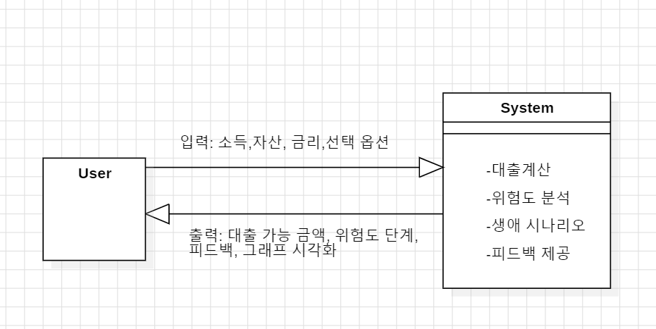

# Conceptualization Report: 금융 시뮬레이션 시스템

**학번:** [22110939]  
**이름:** [여상유]  
**E-Mail:** [sangyu765@gmail.com]

---

## [ Revision History ]

| Revision Date | Version # | Description | Author |
|:---:|:---:|:---|:---:|
| 23/03/2026 | 1.00 | First draft | 여상유 |

---

## = Contents =

1. [Business Purpose](#1-business-purpose)
    * 1.1 Project Background
    * 1.2 Motivation
    * 1.3 Goal
    * 1.4 Target Market
2. [System Context Diagram](#2-system-context-diagram)
3. [Use Case List](#3-use-case-list)
4. [Concept of Operation](#4-concept-of-operation)
5. [Problem Statement](#5-problem-statement)
    * 5.1 Project Problems (Technical Difficulties)
    * 5.2 Non-Functional Requirements (NFRs)
6. [Glossary](#6-glossary)
7. [References](#7-references)

---

## 1. Business Purpose

### 1) Project Background
현대 자본주의 사회는 디지털 금융의 확산으로 개인의 경제적 선택지가 넓어졌으나, 금융 상품의 복잡한 용어와 수치 체계는 여전히 높은 진입장벽으로 작용하고 있습니다. 특히 LTV(Loan-to-Value Ratio) 및 DSR(Debt Service Ratio)과 같은 대출 규제 지표는 실생활과 밀접함에도 불구하고, 금융 소외계층이나 사회 초년생이 직관적으로 이해하기에는 한계가 있습니다.
기존 금융 서비스는 편의성 위주로 발전해 왔으나, 사용자의 자기 주도적 의사결정을 돕는 교육 중심의 기능은 상대적으로 부족합니다. 본 프로젝트는 이러한 교육적 공백을 메우기 위해 시뮬레이션 기반 금융 학습 시스템을 설계하는 것을 목적으로 합니다. 사용자가 소득, 자산, 금리 등 가상의 변수를 직접 입력하고 그에 따른 재무 상태의 변화를 실시간으로 확인하게 함으로써, 수치 변화에 기반한 직관적인 금융 리터러시 향상을 도모하고자 합니다.

### 2) Motivation
본 프로젝트의 동기는 단순한 기능 구현을 넘어, 복잡한 금융 시스템의 알고리즘과 의사결정 프로세스를 공학적 관점에서 심도 있게 이해하는 데 있습니다. 디지털 금융 서비스가 고도화됨에 따라 대출 및 자산 관리 시스템은 다양한 규제 요소를 반영하여 정밀하게 동작합니다.
이러한 메커니즘을 이론적으로만 학습하는 데 그치지 않고, 직접 시스템으로 설계·구현해 보는 과정이 필수적이라고 판단하였습니다. 평소 관심을 가져온 금융 IT(Fintech) 분야의 핵심 개념인 LTV 및 DSR 등을 실제 로직에 적용해 보고, 데이터 시각화를 통해 복잡한 금융 정보를 사용자에게 직관적으로 전달하는 최적의 UI/UX 방안을 고민해 보고자 본 주제를 선정하였습니다.

### 3) Goal
본 프로젝트의 최종 목표는 사용자가 입력과 결과 확인을 통해 금융 개념을 체험적으로 습득할 수 있는 '사용자 참여형 금융 시뮬레이션 플랫폼' 구축에 있으며, 세부 목표는 다음과 같습니다.
1. 대출 시뮬레이션 구현: 사용자의 소득, 자산, 금리 등 다변수 입력값을 기반으로 대출 가능 한도 및 상환 부담을 산출하는 알고리즘 개발.
2. 리스크 분석 및 시각화: LTV와 DSR 지표를 반영하여 사용자의 대출 관점에서의 재무 건전성을 분석하고, 이를 '안전·주의·위험' 단계로 시각화하여 직관적인 피드백 제공.
3. 생애 시나리오 기반 모델링: 다양한 생애 주기별 금융 조건 변화에 따른 결과를 비교 분석할 수 있는 시나리오 모드 구현.

### 4) Target Market
주요 타겟 : 사회 진출을 앞둔 대학생, 사회초년생

부 타겟: 청소년 대상의 경제 교육 기관

---

## 2. System Context Diagram

---

## 3. Use Case List

| order | Name | Actor | Description |
|:---|:---|:---|:---|
| 1 | 금융 정보 입력 | User | 사용자가 소득, 자산, 금리 등의 금융 정보를 입력한다. |
| 2 | 대출 시뮬레이션 실행 | User | 입력된 데이터를 기반으로 대출 가능 금액과 상환 부담을 계산한다. |
| 3 | 시뮬레이션 결과 확인 | User | 계산된 대출 결과와 시각화된 데이터를 사용자에게 제공한다. |
| 4 | 재무 위험도 분석 확인 | User | LTV 및 DSR 기준을 적용하여 사용자의 재무 위험도를 분석하고 단계별 피드백을 제공한다. |
| 5 | 생애 시나리오 선택 | User | 사용자가 다양한 생애 시나리오를 선택한다. |
| 6 | 시나리오 결과 비교 | User | 서로 다른 시나리오 결과를 비교하여 최적의 금융 선택을 지원한다. |

---

## 4. Concept of Operation

### 1) 금융 정보 입력 (Input Financial Data)
**Purpose**: 사용자가 자신의 재무 상태를 반영한 시뮬레이션을 수행할 수 있도록 입력 데이터를 제공하기 위함.

**Approach**: 사용자가 소득, 자산, 금리 등의 정보를 입력하면 시스템은 해당 값을 검증한 후 내부 데이터로 저장하고 이후 계산 모듈에 전달한다.

**Dynamics**: 사용자가 시뮬레이션을 시작하기 전 입력 화면에서 수행된다.

**Goals**: 정확한 금융 시뮬레이션 수행을 위한 기초 데이터 확보.

### 2) 대출 시뮬레이션 실행 (Run Loan Simulation)
**Purpose**: 사용자의 입력 데이터를 기반으로 대출 가능 금액 및 상환 부담을 계산하기 위함.

**Approach**: 입력된 소득, 자산, 금리 데이터를 활용하여 LTV 및 DSR 공식을 적용하고, 대출 가능 한도와 예상 상환액을 산출한다.

**Dynamics**: 사용자가 시뮬레이션 실행을 선택할 때 수행된다.

**Goals**: 사용자에게 현실적인 대출 가능 범위와 재무 부담 정보를 제공.

### 3) 시뮬레이션 결과 확인 (View Simulation Result)
**Purpose**: 계산된 결과를 사용자에게 직관적으로 전달하기 위함.

**Approach**: 시스템은 계산된 대출 금액, 상환 금액 등을 화면에 출력하고 그래프 또는 시각화 요소를 통해 결과를 표현한다.

**Dynamics**: 시뮬레이션 실행 이후 자동으로 결과 화면에서 수행된다.

**Goals**: 사용자가 결과를 쉽게 이해하고 해석할 수 있도록 지원.

### 4) 재무 위험도 분석 확인 (Check Risk Analysis)
**Purpose**: 사용자가 결과를 쉽게 이해하고 해석할 수 있도록 지원.

**Approach**: LTV 및 DSR 기준을 적용하여 사용자의 재무 건전성을 분석하고, 이를 안전/주의/위험 단계로 분류하여 피드백을 제공한다.

**Dynamics**: 시뮬레이션 결과 생성 이후 함께 제공된다.

**Goals**: 사용자가 자신의 재무 상태를 객관적으로 인식하고 위험을 관리할 수 있도록 지원.

### 5) 생애 시나리오 선택 (Select Life Scenario)
**Purpose**: 다양한 상황에서의 금융 조건 변화를 반영하기 위함.

**Approach**: 사용자가 시나리오를 선택하면 해당 조건(소득 변화, 지출 구조 등)이 시스템에 반영된다.

**Dynamics**: 사용자가 시뮬레이션 수행 전 또는 중에 선택할 수 있다.

**Goals**: 현실적인 상황을 반영한 다양한 금융 결과를 제공.

### 6) 시나리오 결과 비교 (Compare Scenarios)
**Purpose**: 여러 시나리오 간의 결과 차이를 분석하여 최적의 선택을 지원하기 위함.

**Approach**: 시스템은 각 시나리오에서 계산되 결과를 동시에 표시하고, 주요 지표(대출 금액, 상환 부담 등)를 비교 가능하도록 시각화한다.

**Dynamics**: 복수의 시나리오 실행 이후 비교 기능 선택 시 수행된다.

**Goals**: 사용자가 다양한 조건을 비교하여 합리적인 금융 의사결정을 내릴 수 있도록 지원.

---

## 5. Problem Statement

### 1) Project Problems (Technical Difficulties)
**Problem #1 - 금융 로직의 복잡성과 정확성 문제**: 
Loan-to-Value Ratio(LTV) 및 Debt Service Ratio(DSR)와 같은 실제 금융 규제 알고리즘을 소득, 부채, 금리 등 다양한 변수 조건에 맞게 오차 없이 계산해야 하며, 이는 높은 수준의 계산 정확성과 로직 설계 능력을 요구합니다.

**Problem #2 - 데이터 시각화의 직관성 문제**: 
복잡한 수치 데이터를 사회초년생이나 고령층 사용자도 쉽게 이해할 수 있도록 차트 및 위험도 지표 형태로 변환해야 하며, 이를 위해 효과적인 UI/UX 설계가 필요합니다.

**Problem #3 - 시나리오 모델링의 어려움**: 
금리 변화, 추가 대출 등 다양한 경제 상황을 반영하여 자산 변화를 예측할 수 있는 시뮬레이션 모델을 설계하는 과정에서 논리적 일관성과 확장성을 확보하는 것이 기술적으로 도전적인 요소입니다.

### 2) Non-Functional Requirements (NFRs)
1. **Accuracy (정확성)**: 
금융 데이터를 다루는 만큼, 시뮬레이션 결과는 실제 금융 규제 기준과 비교하여 높은 수치적 정확도를 유지해야 합니다.

2. **Usability (사용성)**: 
금융 소외 계층을 고려하여 복잡한 용어를 최소화하고 직관적인 인터페이스를 제공해야 합니다.

3. **Responsiveness (반응성)**: 
사용자가 입력값을 변경할 경우, 시뮬레이션 결과와 시각화 데이터는 지연 없이 즉각적으로 갱신되어야 합니다.

4. **Consistency (일관성)**: 
분석 및 설계 단계에서 정의된 모델과 실제 구현 결과가 논리적으로 일치해야 합니다.

5. **Maintainability (유지보수성)**: 
시스템은 모듈화된 구조를 가져야 하며, 기능 수정 및 확장이 용이해야 합니다.

---

## 6. Glossary

1. **LTV (Loan-to-Value Ratio)**: 
주택 담보 가치 대비 대출 금액의 비율을 의미하며, 대출 한도를 결정하는 주요 지표입니다.

2. **DSR (Debt Service Ratio)**: 
연간 소득 대비 모든 부채의 원리금 상환 비율을 의미하며, 개인의 상환 능력을 평가하는 지표입니다.

3. **금융 시뮬레이션 (Financial Simulation)**: 
사용자가 입력한 데이터를 기반으로 다양한 금융 상황을 가정하고 그 결과를 예측하는 시스템 기능입니다.

4. **생애 시나리오 (Life Scenario)**: 
사용자의 상황(사회초년생, 주택 구매 등)에 따라 금융 조건이 달라지는 가상의 환경 설정을 의미합니다.

5. **재무 위험도 (Financial Risk Level)**: 
사용자의 재무 상태를 분석하여 안전, 주의, 위험 단계로 분류한 결과를 의미합니다.

6. **금융 데이터 (Financial Data)**: 
소득, 자산, 부채, 금리 등 금융 시뮬레이션에 사용되는 입력 정보입니다.

7. **시각화 (Visualization)**: 
복잡한 금융 데이터를 그래프나 차트 형태로 표현하여 사용자의 이해를 돕는 과정입니다.

8. **시뮬레이션 결과 (Simulation Result)**: 
입력된 데이터를 기반으로 계산된 대출 가능 금액, 상환 금액 등의 출력 값입니다.

---

## 7. References

1. 금융위원회, “긴급 가계부채 점검회의 및 대출 규제 방안”, 2025.09.07
https://www.fsc.go.kr/edu/news/85343
2. 금융위원회, “DSR 시행방안 확정 발표”, 2025.05.20
https://www.fsc.go.kr/edu/news/84634
3. 한국은행 경제용어사전
https://www.bok.or.kr/portal/ecEdu/ecWordDicary/search.do?menuNo=200688
