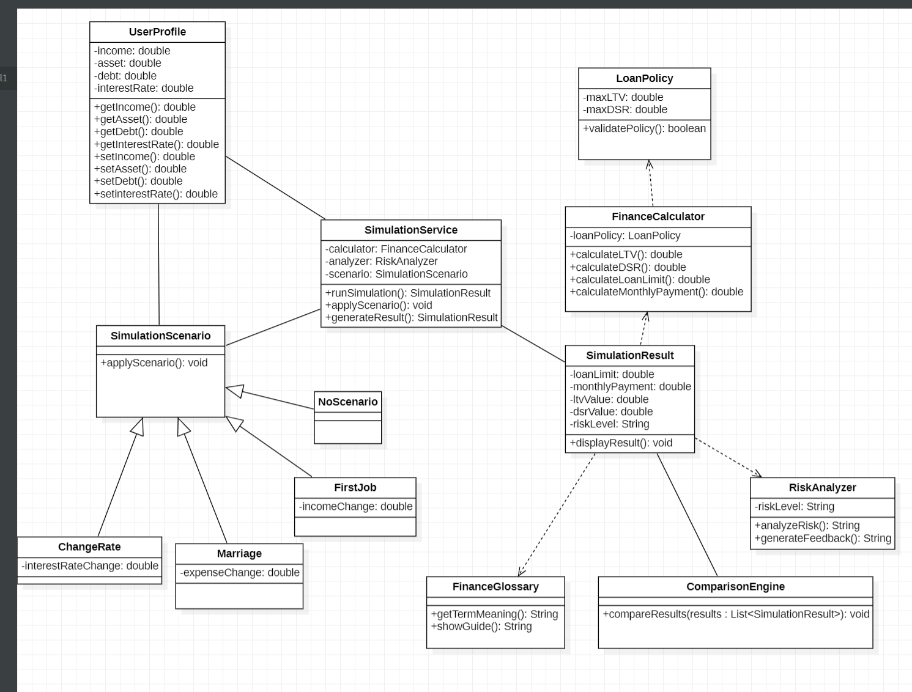
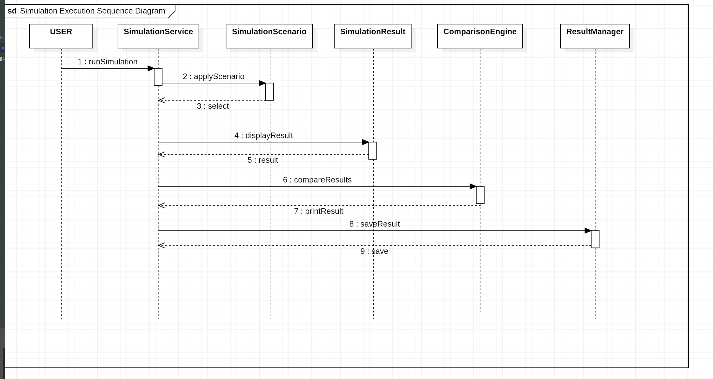
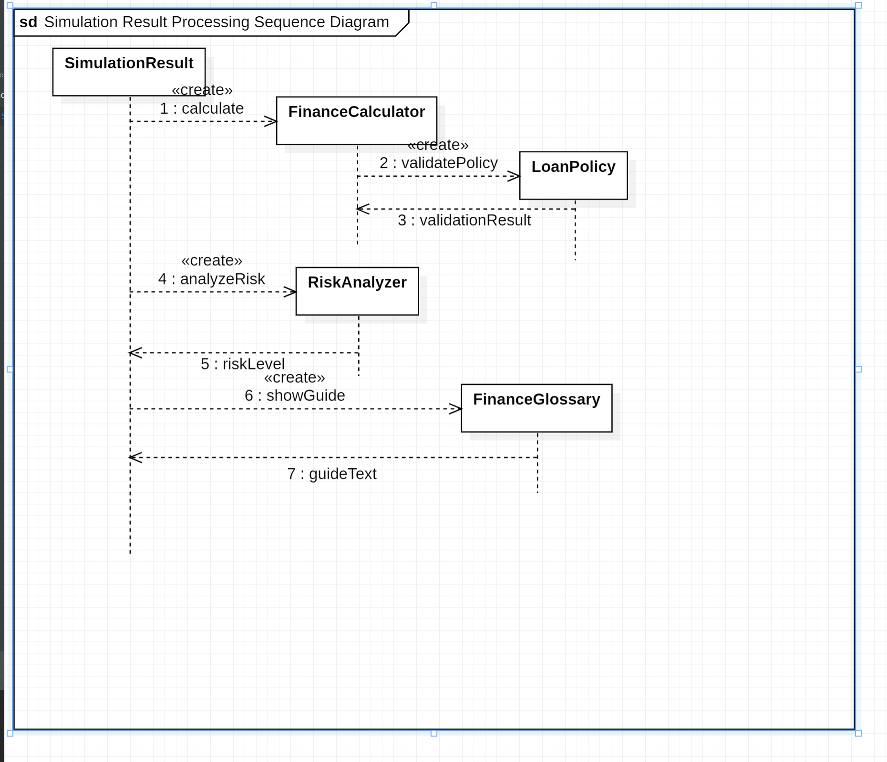
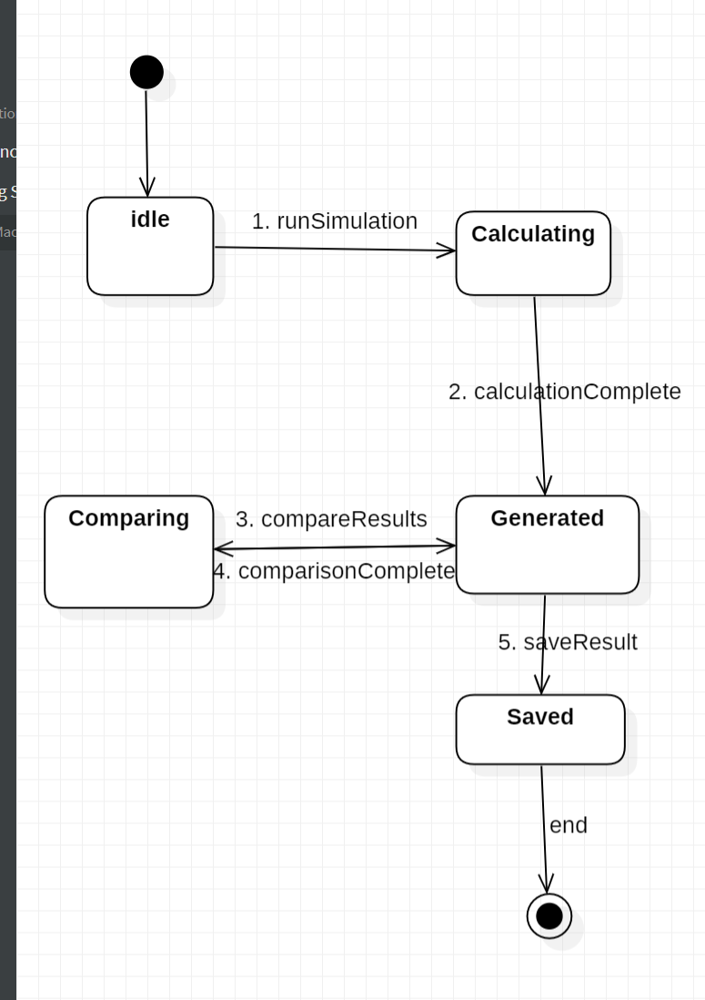

## Design Report: 금융 시뮬레이션 시스템

학번: [22110939]  
이름: [여상유]  
E-Mail: [sangyu765@gmail.com]
---

## [ Revision History ]

| Revision Date | Version # | Description | Author |
|:---:|:---:|:---|:---:|
| 27/05/2026 | 1.00 | First draft | 여상유 |

---

## = Contents =

1. [Introduction]
2. [Class diagram]
3. [Sequence diagram]
4. [State machine diagram]
5. [Implementation requirements]
6. [Glossary]
7. [References]

---

## 1. Introduction

본 문서는 금융 시뮬레이션 시스템의 설계(Design) 단계를 기술한 문서이다.  
본 시스템은 LTV 및 DSR 규제를 기반으로 사용자의 재무 상태를 분석하고 다양한 금융 시나리오를 시뮬레이션하여 합리적인 금융 의사결정을 지원하는 것을 목표로 한다.

본 설계 문서의 목적은 시스템 구현에 필요한 아키텍처 구조, 클래스 설계, 데이터 흐름 및 컴포넌트 간의 상호작용을 정의하는 데 있다. 유지보수성과 확장성을 고려한 구조적 설계를 통해 실제 구현 단계에서 효율적인 개발이 가능하도록 하는 것을 목표로 한다.

본 시스템 설계의 주요 특징은 다음과 같다.

1. 모듈화된 아키텍처 구조  
   시스템을 UI 계층, 서비스 계층, 도메인 계층 등으로 분리하여 유지보수성과 재사용성을 향상시켰다.

2. 책임 분리 기반 설계  
   FinanceCalculator, RiskAnalyzer, ComparisonEngine 등의 핵심 객체가 각각 독립적인 역할을 수행하도록 설계하여 객체 간 결합도를 낮추고 구조적 안정성을 확보하였다.

3. 확장 가능한 시나리오 구조  
   다양한 금융 정책 및 생애 시나리오를 추가할 수 있도록 유연한 구조로 설계하였다.

4. 사용자 중심 인터페이스 고려  
   복잡한 금융 데이터를 그래프 및 시각화 요소를 통해 직관적으로 표현할 수 있도록 UI 구조를 설계하였다.

본 문서에서는 시스템 아키텍처, UML 클래스 다이어그램, 시퀀스 다이어그램, 데이터 설계 및 주요 컴포넌트 간의 동작 구조를 설명한다.

---
## 2. class diagram

### Design Class Component Details

### 1) UserProfile
#### (1) Attributes
- **income: double** : 시뮬레이션의 기준이 되는 사용자의 연간 소득
- **asset: double** : 사용자가 현재 보유 중인 자산 총액
- **debt: double** : 사용자가 기존에 보유하고 있는 총부채 금액
- **interestRate: double** : 시뮬레이션에 적용할 기본 대출 금리

#### (2) Methods
- **+getIncome(): double** : 저장된 사용자 소득 데이터를 반환
- **+getAsset(): double** : 저장된 사용자 자산 데이터를 반환
- **+getDebt(): double** : 저장된 사용자 부채 데이터를 반환
- **+getInterestRate(): double** : 저장된 대출 금리 데이터를 반환
- **+setIncome(income: double): void** : 사용자의 소득 데이터를 새롭게 설정 및 수정
- **+setAsset(asset: double): void** : 사용자의 자산 데이터를 새롭게 설정 및 수정
- **+setDebt(debt: double): void** : 사용자의 부채 데이터를 새롭게 설정 및 수정
- **+setInterestRate(interestRate: double): void** : 적용할 대출 금리 데이터를 새롭게 설정 및 수정

---

### 2) SimulationService
#### (1) Attributes
- **-calculator: FinanceCalculator** : 금융 수치 연산을 수행하는 계산기 객체 매핑
- **-analyzer: RiskAnalyzer** : 리스크 등급을 판정하는 분석기 객체 매핑
- **-scenario: SimulationScenario** : 적용할 생애 주기 시나리오 객체 매핑

#### (2) Methods
- **+runSimulation(): SimulationResult** : 전체 금융 시뮬레이션을 실행하고 결과 객체를 생성
- **+applyScenario(): void** : 사용자가 선택한 시나리오의 가중치 및 변수를 시스템에 반영
- **+generateResult(): SimulationResult** : 최종 연산 및 분석이 완료된 결과 데이터를 조립하여 반환

---

### 3) SimulationScenario
#### (1) Attributes
- 본 클래스는 추상 클래스(Abstract Class)로, 하위 시나리오들의 공통 규격만 정의하며 별도의 고유 속성을 두지 않음

#### (2) Methods
- **+applyScenario(): void** : 각 시나리오별 조건 변수를 재정의하기 위한 추상 메서드

---

### 4) NoScenario
#### (1) Attributes
- **고유 속성 없음** : 어떠한 환경 변화도 주지 않는 기본 상태를 유지

#### (2) Methods
- **고유 메서드 없음** : 부모 클래스의 기본 메커니즘을 그대로 따름

---

### 5) FirstJob
#### (1) Attributes
- **-incomeChange: double** : 취업 및 이직으로 인해 변동되는 소득 증가액

#### (2) Methods
- **고유 메서드 없음** : 부모의 `applyScenario()`를 오버라이딩하여 변동된 소득을 계산기에 반영

---

### 6) Marriage
#### (1) Attributes
- **-expenseChange: double** : 결혼으로 인해 증가하거나 변동되는 지출 및 자산 변동액

#### (2) Methods
- **고유 메서드 없음** : 부모의 `applyScenario()`를 오버라이딩하여 변동된 지출을 계산기에 반영

---

### 7) ChangeRate
#### (1) Attributes
- **-interestRateChange: double** : 시장 상황에 따라 변동되는 대출 금리 조정치

#### (2) Methods
- **고유 메서드 없음** : 부모의 `applyScenario()`를 오버라이딩하여 변동된 금리를 계산기에 반영

---

### 8) FinanceCalculator
#### (1) Attributes
- **-loanPolicy: LoanPolicy** : 계산 시 참조할 법적 금융 규제 정책 객체 매핑

#### (2) Methods
- **+calculateLTV(): double** : 자산 및 담보 가치 대비 대출 비율(LTV)을 연산
- **+calculateDSR(): double** : 소득 대비 전체 부채 원리금 상환 비율(DSR)을 연산
- **+calculateLoanLimit(): double** : 규제 한도 내에서 최대로 받을 수 있는 대출 가능 금액을 산출
- **+calculateMonthlyPayment(): double** : 선택한 금리와 대출액 기준 월별 균등 상환 금액을 연산

---

### 9) LoanPolicy
#### (1) Attributes
- **-maxLTV: double** : 정부가 규정한 최대 주택담보대출비율(LTV) 상한선 (예: 0.70)
- **-maxDSR: double** : 정부가 규정한 최대 총부채원리금상환비율(DSR) 상한선 (예: 0.40)

#### (2) Methods
- **+validatePolicy(): boolean** : 현재 설정된 규제 비율이 최신 금융법 기준에 부합하는지 유효성 검증

---

### 10) SimulationResult
#### (1) Attributes
- **-loanLimit: double** : 최종 산출된 대출 가능 금액 결과 값
- **-monthlyPayment: double** : 매달 상환해야 하는 원리금 결과 값
- **-ltvValue: double** : 사용자의 조건으로 계산된 LTV 수치 결과 값
- **-dsrValue: double** : 사용자의 조건으로 계산된 DSR 수치 결과 값
- **-riskLevel: String** : 판정된 재무 위험도 등급 문자열 (안전/주의/위험)

#### (2) Methods
- **+displayResult(): void** : 최종 산출된 수치들을 화면에 포맷팅하여 출력

---

### 11) RiskAnalyzer
#### (1) Attributes
- **-riskLevel: String** : 분석 프로세스 중 임시 보관되는 리스크 등급 상태 값

#### (2) Methods
- **+analyzeRisk(): String** : 계산된 LTV/DSR 수치를 분석하여 최종 리스크 등급을 결정하고 반환
- **+generateFeedback(): String** : 결정된 위험 등급에 맞는 개인 맞춤형 금융 조언 가이드 문장을 생성

---

### 12) ComparisonEngine
#### (1) Attributes
- **고유 속성 없음** : 유연한 비교 연산을 위해 상태 값을 저장하지 않는 컨트롤러 역할을 수행

#### (2) Methods
- **+compareResults(results: List<SimulationResult>): void** : 여러 개의 시뮬레이션 결과 객체들을 전달받아 주요 지표의 차이점을 대조 분석 후 출력 화면으로 전달

---

### 13) FinanceGlossary
#### (1) Attributes
- **고유 속성 없음** : 용어 데이터를 매핑하여 즉시 반환하는 바운더리 역할을 수행

#### (2) Methods
- **+getTermMeaning(): String** : 사용자가 요청한 특정 금융 용어(LTV, DSR 등)의 명확한 정의를 반환
- **+showGuide(): String** : 초보자를 위한 금융 가이드라인 및 기초 교육 텍스트를 화면에 반환

---

## 3. Sequence Diagram

### 3.1 순차 다이어그램 개요
본 절에서는 시스템의 정적 구조를 정의한 클래스 다이어그램을 바탕으로 실행 시점(Runtime)에 객체들 간에 주고받는 동적 메시지와 시간 흐름에 따른 상호작용을 기술합니다. 

---

### 3.2 [시나리오 1] 대출 시뮬레이션 및 결과 관리 흐름 (거시적 제어)
사용자가 시스템을 구동하여 시나리오를 선택하고 산출된 결과를 비교 및 저장하는 전체적인 컨트롤러 중심의 실행 흐름을 기술합니다.

#### (1) Step-by-Step 흐름 명세
1. **시뮬레이션 시작**: 사용자(`USER`)가 화면을 통해 전체 금융 시뮬레이션의 시작 버튼을 누르면 `SimulationService` 객체의 `runSimulation` 메서드가 호출됩니다.
2. **생애 주기 시나리오 반영**: `SimulationService`는 사용자가 선택한 조건(취업, 결혼, 금리 변동 등)을 시스템에 적용하기 위해 `SimulationScenario` 객체의 `applyScenario`를 호출하며, 처리가 완료되면 제어권이 반환됩니다.
3. **결과 인터페이스 활성화**: 시나리오 셋팅이 완료되면 `SimulationService`는 최종 결과 및 화면 출력을 전담하는 `SimulationResult` 객체에게 `displayResult` 메시지를 보내 해당 컴포넌트를 활성화합니다.
4. **결과 대조 분석**: 사용자가 이전 시뮬레이션 결과들과의 대조를 원할 경우 `SimulationService`는 `ComparisonEngine` 객체에게 `compareResults` 메시지를 보내 복수의 결과 데이터를 비교 분석하도록 명령합니다.
5. **리포트 저장 및 영속화**: 시뮬레이션이 최종 완료되면 `SimulationService`는 데이터 관리 전담 객체인 `ResultManager`에게 `saveResult` 메시지를 전송하여 현재 결과를 파일이나 스토리지에 안전하게 저장(Save)하며 전체 프로세스가 종료됩니다.

---

### 3.3 [시나리오 2] 금융 수치 연산 및 리스크 분석 흐름 
`SimulationResult` 객체가 활성화된 이후에 사용자의 입력 데이터와 법적 규제 정책을 바탕으로 내부 금융 엔진들을 조작하여 종합 지표를 완성해 나가는 상세 연산 흐름을 기술합니다.

#### (1) Step-by-Step 흐름 명세
1. **금융 연산 요청**: `SimulationResult`는 활성화 직후 종합 데이터를 산출하기 위해 금융 연산 전담 객체인 `FinanceCalculator`에게 `calculate` 메시지를 전송한다.
2. **금융 규제 정책 검증**: 요청을 받은 `FinanceCalculator`는 연산 로직을 수행하기 전, 주택담보대출 규제(LTV, DSR 비율 등)를 보유한 `LoanPolicy` 객체에게 `validatePolicy` 메시지를 보내 현재 기준의 유효성을 검증받고 결과(`check`)를 반환습니다.
3. **리스크 등급 판정**: 계산기를 통해 LTV, DSR, 대출 한도 금액이 모두 산출되고 `SimulationResult`는 `RiskAnalyzer` 객체에게 `analyzeRisk` 메시지를 전송하여 현재 재무 상태의 위험도(안전/주의/위험) 분석 결과를 `riskLevel` 데이터로 수집합니다.
4. **초보자 가이드 매핑**: 마지막으로 금융 초보자들을 위한 맞춤형 용어 지원을 위해 `FinanceGlossary` 객체에게 `showGuide` 메시지를 전송하여 LTV, DSR 등의 복잡한 금융 전문 용어 정의서와 가이드 라인을 수집 및 출력하며 데이터 종합을 완료합니다.

---
## 4 State machine diagram

본 상태 다이어그램은 시스템의 핵심 데이터 객체이자 화면 컴포넌트인 `SimulationResult`가 생성되어 사용자의 상호작용에 따라 어떻게 상태가 전이(State Transition)되는지 시간 흐름과 이벤트 중심으로 기술합니다.

1. **Empty (초기 대기 상태)**
   * **명세**: 사용자가 시스템을 구동한 후 아직 입력 데이터를 전송하지 않았거나 시뮬레이션이 시작되기 전의 빈 화면 상태(Initial State)입니다.
   * **전이 조건**: 사용자가 화면에서 '시뮬레이션 시작' 버튼을 눌러 `1. runSimulation()` 이벤트가 발생하면 `Calculating` 상태로 전이합니다.

2. **Calculating (연산 및 분석 중 상태)**
   * **명세**: `SimulationService`의 제어 아래 `FinanceCalculator`가 LTV, DSR 및 대출 한도를 연산하고 `RiskAnalyzer`가 위험 등급을 판정하는 시스템 내부의 동적 연산 상태입니다.
   * **전이 조건**: 계산기와 분석기의 모든 작업이 정상적으로 완료되어 `2. calculationComplete` 이벤트가 발생하면 최종 결과 데이터가 채워진 `Generated` 상태로 전이합니다.

3. **Generated (결과 생성 및 활성화 상태)**
   * **명세**: 사용자의 조건에 맞는 대출 제한 금액, 월 원리금 상환액, 리스크 등급 피드백이 종합되어 화면에 포맷팅되어 출력된 중심 상태이다. 사용자는 이 상태에서 결과 리포트를 확인하고 다음 행동을 선택할 수 있습니다.

4. **Comparing (시나리오 비교 중 상태)**
   * **명세**: 사용자가 현재 결과 외에 다른 생애 주기 시나리오 결과들과의 대조를 위해 `3. compareResults()` 이벤트를 발생시켰을 때 진입하는 일시적 상태입니다.
   * **전이 조건**: `ComparisonEngine`에 의해 다중 결과 객체들의 지표 대조 분석이 완료(`4. comparisonComplete`)되면 사용자가 기존 리포트를 다시 확인할 수 있도록 상위 상태인 `Generated` 상태로 즉시 복귀(Return)합니다.

5. **Saved (저장 완료 상태)**
   * **명세**: 사용자가 산출된 재무 리포트를 영속적으로 보관하기 위해 `5. saveResult()` 이벤트를 발생시켜 `ResultManager`가 파일 또는 스토리지에 저장을 완료한 최종 상태입니다. 
   * **전이 조건**: 저장이 성공적으로 마무리되면 `6. (종료)` 시그널과 함께 모든 프로세스가 정상 종료(Final State)됩니다.

---
## 5. Implementation Requirements

### 5.1. H/W platform requirements
* **CPU**: Intel Core i3 이상
* **RAM**: 4GB 이상
* **Storage**: HDD / SSD 10GB 이상의 여유 공간
* **Network**: 금융 데이터 연산 및 외부 공유를 위한 인터넷 연결 필요

### 5.2. S/W platform requirements
* **OS**: Microsoft Windows 7 이상
* **Implementation Language**: Java 17 (JDK 17)

---
 ---
### 6. Glossary
| 용어 | 영문 명칭 | 정의 |
| :--- | :--- | :--- |
| **LTV** | Loan to Value Ratio | **주택담보대출비율.** 자산 및 담보 가치 대비 최대로 대출받을 수 있는 금액의 비율. |
| **DSR** | Debt Service Ratio | **총부채원리금상환비율.** 연간 소득에서 모든 대출의 연간 원리금 상환액이 차지하는 비율. |
| **오버라이딩** | Overriding | 상위 클래스(`SimulationScenario`)가 가지고 있는 메서드를 하위 클래스가 재정의하여 사용하는 객체지향 개념. |
| **영속화** | Persistence | 프로그램이 종료되어도 데이터가 사라지지 않고 파일 시스템(`ResultManager`) 등에 저장되어 유지되는 특성. |

---
### 7. References
1. 대한민국 금융위원회 (2026) - 가계대출 규제 관리 방안 (LTV/DSR 운영 가이드라인)
2. Oracle Java SE 17 Documentation - `https://docs.oracle.com/en/java/javase/17/`

